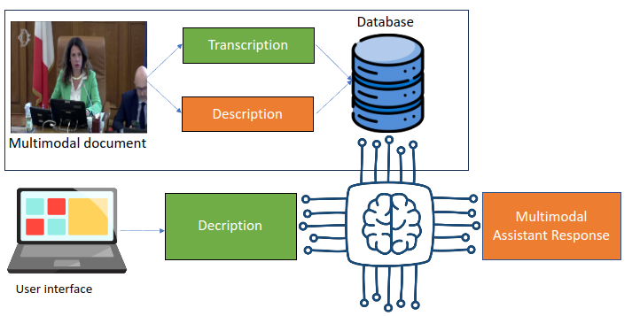
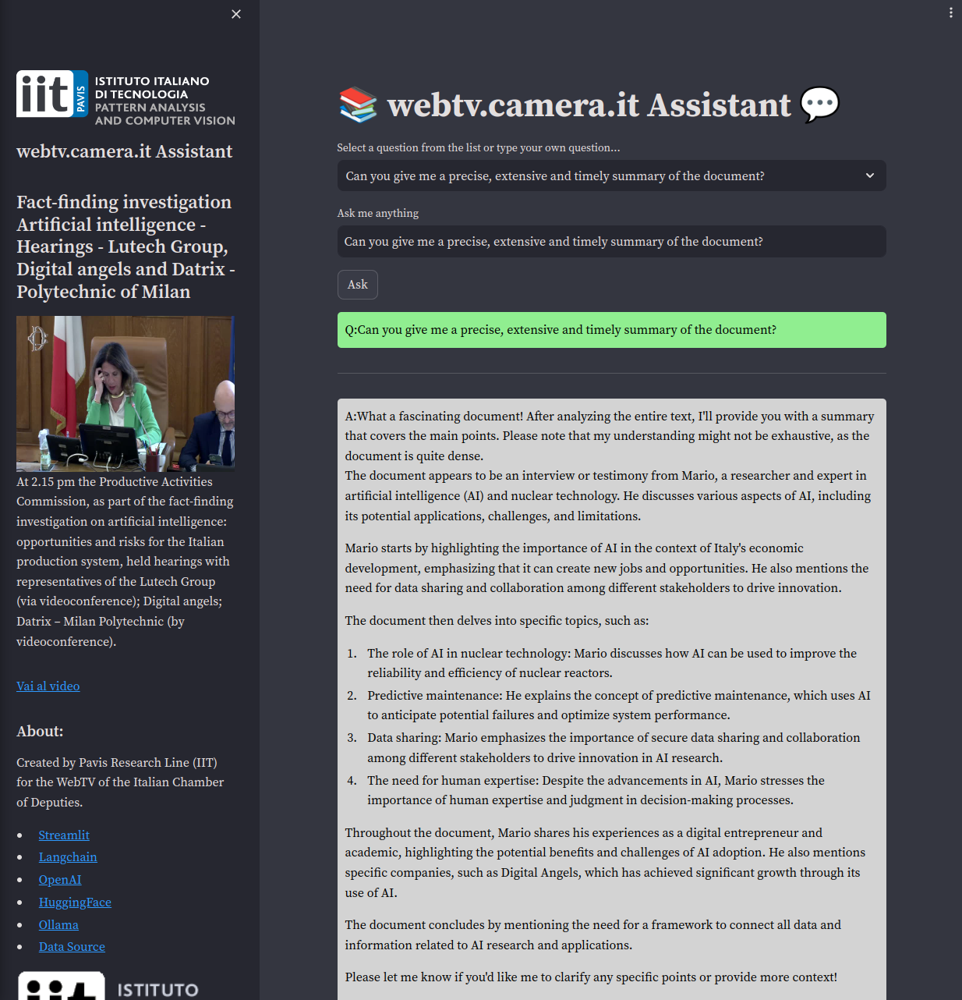

# MMRAGDB with openai/ollama bots to search in video database using RAG with Langchain/ChromaDB

MMRAGDB (MultiModail RAG Database) permits to search in video database using RAG model with Langchain/ChromaDB. The project is based on the idea of using multimodal documents to search in a video database using a natural language question. The multimodal documents are created from videos with audio, text and images. The text is extracted from audio using Google Speech Recognition, the images are extracted from video using LLava or similar and the text and images are merged in a single document. The merged document is then ingested in ChromaDB to create embeddings. The embeddings are then used to search in the database using a natural language question with RAG model.

This project can be switched between openai and ollama models. Ollama is the best choice for a general use case and openai is the best choice for a specific use case.




## Project Description:

- Questions can be in natural language and the LLM will be able to answer to them on whole database

- search on whole database with a single question is performed with LangChain/ChromaDB usage

## Potential Use Cases:

- Search in a multimodal database using a natural language question

- Get more information on a video using a natural language question

- In this project Italian Parliament videos are used as a database, but it can be used for any video database (there is a scrape.py file that can be used to scrape videos from parliamnet website)

- The project can be used to search for things in a video database using a natural language question

An application is showed here with Italian Parliament videos as database:



## Tools and Technologies:

- Video Database is scraped using scrape.py and saved into a folder

- Video Database is converted to text from video folder using create_database.py and saved in a Postgresql database

- create_database.py extracts the audio from the video and then converts the audio to text using Google Speech Recognition with transcribe.py and save the results in a transcriptions text file. The transcription is sbdivided in chunks on N seconds and the chunks are saved in a chunks text file

- create_database.py analyze images from video with video2desc.py (using LLava or similar, in particular moe-llava https://github.com/PKU-YuanGroup/MoE-LLaVA) and save the results in a desctiptions text file. The descriptions are performed every N seconds and the descriptions are saved in a descriptions text file

- create_database.py mixes the text and the images and save the results in a merged text file (an italian to english translation is performed because opensource LLM prefers english tex for best performance, so the merged text file is in english language)

- application/ingest.py permits to create embeddings and save them on ChromaDB database in db folder

- application/app.py is the main file that permits to search in the database using a natural language question and the RAG model with embeddings from ChromaDB

there are two versions of the project, one with openai and one with ollama models. 


## Ollama Usage
Ollama approach seems to be the cheapest and the most general, so it is the best choice for a general use case.

use these commands to run the project with ollama/chromaDB, scraping videos from Italian Parliament website and create MMRAG preprocessed merged text files:

create the environment 

```bash
eval "$(/home/dexmac/anaconda3/bin/conda shell.bash hook)"
conda create -n mmrag_ollama python==3.10 -y
Install the pip packages ```pip install -r requirements_ollama.txt```
```

Check README.md in ollama folder to continue the setup and run the project

## Openai Usage
Openai approach seems to be the most powerful and the most specific, so it is the best choice for a specific use case. The only problem is that it is not free to use and it requires an API key.

use these commands to run the project with openai, scraping videos from Italian Parliament website and create MMRAG preprocessed merged text files:

```bash
eval "$(/home/dexmac/anaconda3/bin/conda shell.bash hook)"
conda create -n mmrag_openai python==3.10 -y
Install the pip packages ```pip install -r requirements_openai.txt```
```

## Scrape original database

```bash
# in the parliament case you could scrape the videos from the website
python scrape.py --begin 24495 --stop 24497 --output_folder ./videos
```

you can also use get_video.py to download a single video from the website

```bash
python get_video.py --base_url https://webtv.camera.it/evento/24801 --output_folder ./videos
```

## Convert multimodal documents to chunked merged text

Convert multimodal documents to special timestamped chunked text

```bash
# in the parliament case you could scrape the videos from the website
python create_database.py --documents ./videos --target ./target
cd applications/parliament
```

check the README.md in the applications/parliament folder to continue the setup and run the project


